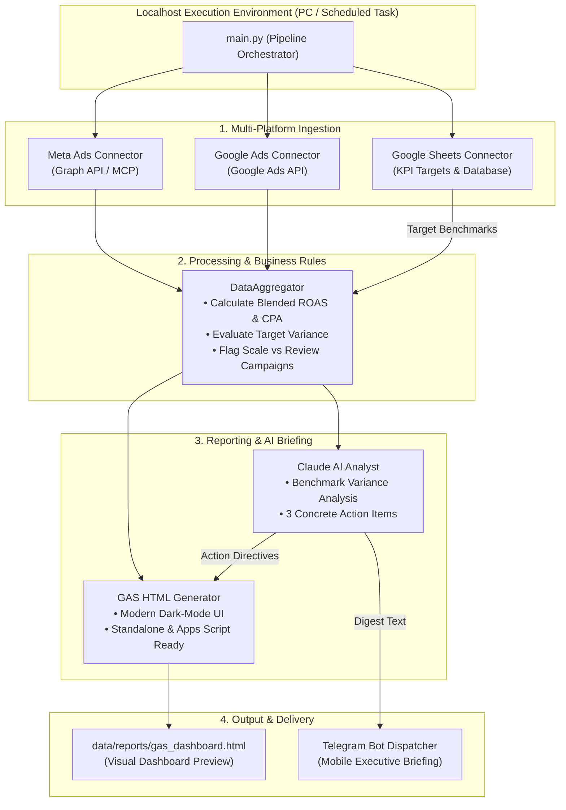

# Multi-Platform Marketing Operations & Automated AI Reporting System

A Python-based internal automation workflow that aggregates advertising performance data across **Meta (Facebook) Ads**, **Google Ads**, and **Google Sheets**, computes unified blended KPIs, generates a standalone **Google Apps Script (GAS) HTML Dashboard**, and synthesizes executive operational briefings using **Claude AI** delivered straight to a **Telegram Bot**.

---

## Overview

In multi-channel marketing operations, daily decision-making requires combining ad spend, conversion counts, and return-on-ad-spend (ROAS) from fragmented platforms. 

This repository demonstrates a **practical localhost-first automation engine** inspired by real-world internal systems work. Built around operations first, it automates daily data ingestion, applies business rules against company targets, generates an executive dashboard view, and creates actionable operational directives without expensive always-on cloud infrastructure.

> [!NOTE]
> **Author:** Malek Saifullizan — *AI Automation & Internal Systems Developer*  
> **Portfolio:** [me.webbku.com](https://me.webbku.com/)  
> **Philosophy:** Operations First. Understand the process before automating it.

---

## Business Problem

Businesses running concurrent campaigns across Meta Ads and Google Ads face common daily operational bottlenecks:
1. **Fragmented Data & Repetitive Manual Work:** Staff spend 30–60 minutes every morning logging into separate ad managers, downloading CSVs, and copying numbers into spreadsheets.
2. **Delayed Optimization Decisions:** Performance trends (e.g., ad fatigue, sudden CPA spikes, out-of-stock items) are often noticed days late because data compilation is tedious.
3. **Over-Engineering & Server Cost Waste:** Small-to-medium teams often incur unnecessary monthly cloud bills hosting 24/7 servers for simple batch workloads that only need to run once per day.

---

## Solution

A lean, modular Python automation pipeline that executes locally on a workstation or scheduled cron:
- **Unified Ingestion:** Pulls performance metrics from Meta Ads and Google Ads, aligning them with target benchmarks stored in Google Sheets.
- **Business Rule Processing:** Evaluates live blended metrics (Total Spend, Gross Revenue, Blended ROAS, Blended CPA) and flags campaigns requiring immediate scaling or pausing.
- **GAS-Compatible HTML Dashboard:** Auto-generates a clean, responsive dark-mode HTML report ready for Google Apps Script `HtmlService` or instant local browser viewing.
- **AI-Powered Synthesis:** Invokes Claude AI to analyze variance against targets and produce 3 actionable directives.
- **Instant Mobile Digest:** Dispatches a structured, emoji-rich summary to Telegram for immediate mobile review by operations leaders.

---

## Architecture



---

## Workflow

1. **Trigger:** The operator runs `python main.py` on localhost (or an automated scheduled task triggers the script at 08:00 AM).
2. **Ingestion:** Connectors ingest yesterday's performance records from Meta Ads and Google Ads, and sync KPI targets from Google Sheets.
3. **Cross-Channel Computation:** The aggregator computes blended spend, revenue, blended ROAS, and CPA, checking thresholds (`ROAS >= 4.0x` for budget scaling; `ROAS <= 1.5x` for creative review).
4. **AI Analysis:** The Claude AI engine evaluates performance against Google Sheets targets and outlines operational next steps.
5. **Dashboard Compilation:** An interactive HTML dashboard (`gas_dashboard.html`) is compiled with KPI metric cards, platform distribution progress bars, and campaign audit tables.
6. **Telegram Notification:** An executive briefing is formatted and delivered to Telegram, complete with key figures and Claude AI recommendations.

---

## Technology

- **Language:** Python 3.10+ (Standard Library: `urllib`, `json`, `dataclasses`, `pathlib`, `unittest`)
- **Reporting:** Vanilla HTML5, CSS3 (Modern dark-mode design system with responsive flexbox and CSS grids, Google Fonts: Inter & JetBrains Mono)
- **Compatibility:** Google Apps Script (`HtmlService.createHtmlOutputFromFile`)
- **AI Integration:** Claude AI / Claude Code CLI reasoning framework
- **Messaging:** Telegram Bot API
- **Testing:** `unittest` / `pytest`

---

## Project Structure

```text
python-business-automation-demo/
├── data/
│   ├── sample/
│   │   ├── fb_ads_data.json            # Realistic Meta Ads campaign sample data
│   │   ├── google_ads_data.json        # Realistic Google Ads campaign sample data
│   │   └── sheets_targets.json         # Google Sheets KPI targets & rules
│   └── reports/
│       └── gas_dashboard.html          # Generated Google Apps Script HTML report
├── docs/
│   └── architecture.md                 # Detailed architecture & technical specs
├── src/
│   ├── __init__.py
│   ├── config.py                       # Safe environment loading & path resolution
│   ├── connectors/
│   │   ├── __init__.py
│   │   ├── fb_ads.py                   # Meta Ads API / MCP connector
│   │   ├── google_ads.py               # Google Ads API connector
│   │   └── google_sheets.py            # Google Sheets target database connector
│   ├── core/
│   │   ├── __init__.py
│   │   ├── aggregator.py               # Multi-platform KPI calculation engine
│   │   └── gas_generator.py            # GAS HTML Dashboard generator
│   ├── ai/
│   │   ├── __init__.py
│   │   └── claude_analyst.py           # Claude AI operational insights engine
│   └── notifiers/
│       ├── __init__.py
│       └── telegram.py                 # Telegram Bot digest formatting & delivery
├── main.py                             # Single command pipeline orchestrator
├── test_demo.py                        # Complete automated test suite
├── .env.example                        # Safe environment variable template
├── .gitignore                          # Standard git ignore rules (includes doc/)
├── requirements.txt                    # Project requirements
├── LICENSE                             # MIT License
└── README.md                           # Public showcase documentation
```

---

## Setup

### 1. Clone the Repository
```bash
git clone https://github.com/your-username/python-business-automation-demo.git
cd python-business-automation-demo
```

### 2. Verify Python Installation
Python 3.10 or higher is required. Verify with:
```bash
python --version
```

### 3. (Optional) Set Up Virtual Environment
The demonstration is engineered to run out of the box using Python's standard library. If you wish to use a virtual environment:
```bash
python -m venv venv
# On Windows:
venv\Scripts\activate
# On macOS/Linux:
source venv/bin/activate

pip install -r requirements.txt
```

---

## Configuration

Copy the example environment file:
```bash
cp .env.example .env
```

The demonstration operates immediately with realistic simulation data without requiring API keys. If you wish to configure live credentials:

| Variable | Description |
| :--- | :--- |
| `APP_ENV` | Set to `demo` (default) or `production` |
| `ANTHROPIC_API_KEY` | (Optional) Anthropic Claude API Key for live AI queries |
| `TELEGRAM_BOT_TOKEN` | (Optional) Telegram Bot API token |
| `TELEGRAM_CHAT_ID` | (Optional) Target Telegram Channel or Group Chat ID |

---

## Running the Demo

Run the main pipeline from your terminal:
```bash
python main.py
```

### Running the Test Suite
Execute the automated test suite verifying all connectors, calculations, and generators:
```bash
python test_demo.py
```

---

## Example Output

### Terminal Execution:
```text
====================================================================
  MULTI-PLATFORM MARKETING AUTOMATION & AI REPORTING ENGINE
  Localhost Business Operations Pipeline
====================================================================

[1/5] Ingesting multi-platform marketing data...
      ✓ Meta Ads: 3 active campaigns loaded (Spend: MYR 750.00)
      ✓ Google Ads: 3 campaigns loaded (Spend: MYR 625.00)
      ✓ Google Sheets: Target benchmarks & rules synchronized.

[2/5] Aggregating metrics & calculating cross-channel KPIs...
      → Total Ad Spend:   MYR 1,375.00
      → Total Revenue:    MYR 5,323.00
      → Blended ROAS:     3.87x (Target: 3.50x [EXCEEDED])
      → Blended CPA:      MYR 13.22 | Purchases: 104

[3/5] Invoking Claude AI intelligence engine...
      ✓ Model: Claude 3.5 Sonnet (Demonstration Flow)
      ✓ 3 operational action items generated.

[4/5] Generating Google Apps Script (GAS) HTML Dashboard...
      ✓ Dashboard generated: data\reports\gas_dashboard.html

[5/5] Formatting and dispatching Telegram executive briefing...
      ✓ Telegram status: SIMULATED

--------------------------------------------------------------------
TELEGRAM DISPATCH PREVIEW:
--------------------------------------------------------------------
📊 *DAILY MARKETING BRIEFING — 2026-09-13*
━━━━━━━━━━━━━━━━━━━━━━━━━━
💰 *Total Spend:* MYR 1,375.00
💵 *Total Revenue:* MYR 5,323.00
📈 *Blended ROAS:* 3.87x (Target: 3.50x ✅)
🎯 *Blended CPA:* MYR 13.22 | Conversions: 104
🌐 *Channel Share:* Meta 54.5% | Google 45.5%
━━━━━━━━━━━━━━━━━━━━━━━━━━
⚡ *CLAUDE AI OPERATIONAL ACTIONS:*
  • Scale Budget (+20%): Increase allocation on 'Advantage+ Shopping - Ramadan / Raya Promotion' (Meta Ads, ROAS 4.05x).
  • Creative Refresh / Review: Investigate 'Top of Funnel - Brand Video UGC Awareness' (Meta Ads, ROAS 1.2x). Consider refreshing UGC creatives.
  • Inventory Check: Ensure stock availability for top converting items as daily volume reaches 104 purchases.
━━━━━━━━━━━━━━━━━━━━━━━━━━
🔗 *GAS Dashboard:* `reports/gas_dashboard.html`
🤖 *Triggered via:* Localhost Python Automation Pipeline
--------------------------------------------------------------------

[DONE] Pipeline completed successfully.
       Open dashboard in browser: file:///.../data/reports/gas_dashboard.html
```

### Visual Dashboard (`data/reports/gas_dashboard.html`):
The generated dashboard features a modern dark-mode interface with:
- Top-level KPI metric cards (Total Spend, Revenue, Blended ROAS, Blended CPA, Total Conversions).
- Claude AI Operational Briefing panel.
- Cross-platform allocation progress indicators (Meta Ads vs Google Ads).
- Granular campaign performance table with active/paused status indicators and return-on-ad-spend ratings.

---

## Security Notes

- **Zero Hardcoded Secrets:** No API keys, access tokens, customer identifiers, or proprietary credentials exist in this repository.
- **Sanitized Mock Data:** All sample data structures are fabricated for demonstration and represent realistic industry scenarios without using real company data.
- **Git Ignored Sensitive Files:** `.env`, `.env.local`, and internal planning directories are excluded via `.gitignore`.

---

## Production Context

> [!IMPORTANT]
> **Production Context Notice:**  
> This public repository is a demonstration implementation inspired by a real-world multi-platform marketing operations and reporting automation workflow. The production implementation and business-specific configuration are private.

In production environments, this pattern connects directly to live enterprise ad accounts and Google Sheets via secure OAuth2 service accounts and CLI MCP configurations, operating as an indispensable operational tool for daily marketing coordination.

---

## Limitations

- This demonstration focuses on daily batch aggregation rather than real-time streaming event listeners.
- Historical trend charting is scoped to single-day audit comparisons; multi-quarter longitudinal analysis would typically be routed into a dedicated data warehouse (e.g., BigQuery).
- The default execution uses built-in heuristic AI synthesis so reviewers can test the pipeline immediately without entering a paid API key.

---

## Future Improvements

- [ ] Automated export directly to Google Drive via Google Apps Script webhook trigger.
- [ ] WhatsApp Business notification adapter alongside the Telegram Bot dispatcher.
- [ ] Automated ad creative fatigue detection using week-over-week CTR variance.

---

## Author & Contact

**Malek Saifullizan**  
*AI Automation & Internal Systems Developer*  
- Portfolio: [me.webbku.com](https://me.webbku.com/)  
- Expertise: AI Automation, Internal Systems, Python, PHP, JavaScript, APIs, Webhooks, Google Apps Script
