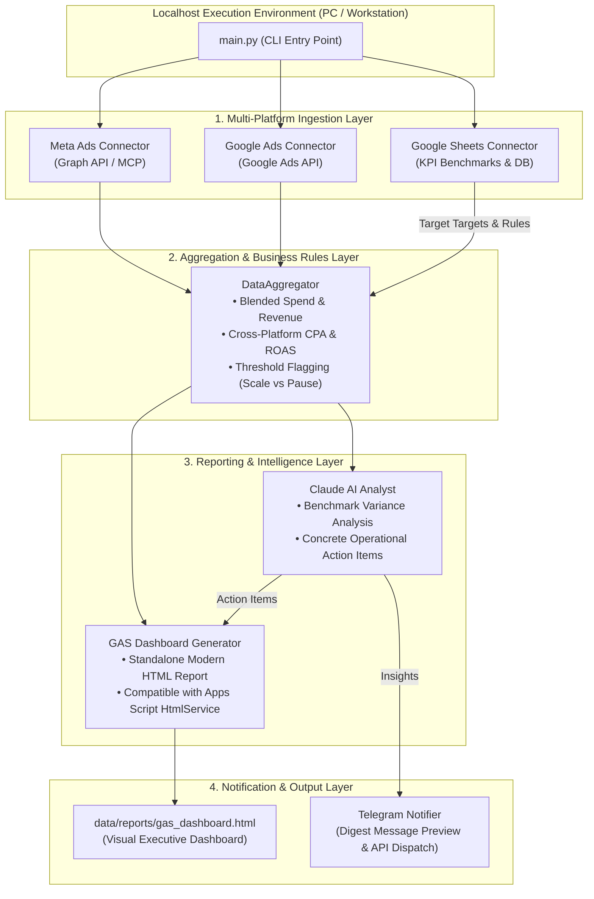

# Architecture Documentation

## System Overview

This demonstration illustrates an internal marketing operations data aggregation and AI reporting pipeline. Designed to run locally on a workstation (localhost), it aggregates cross-channel advertising data from **Meta (Facebook) Ads**, **Google Ads**, and **Google Sheets**, computes blended return-on-ad-spend (ROAS) and unit economics, produces a **Google Apps Script (GAS) compatible HTML dashboard**, and synthesizes executive insights via a **Claude AI** analysis engine for automated dispatch to a **Telegram Bot**.

---

## Architectural Diagram

---

## Component Breakdown

### 1. Data Ingestion Layer (`src/connectors/`)
- **`MetaAdsConnector`**: Interfaces with campaign-level metrics for Meta Ads (Spend, Impressions, Clicks, Conversions, ROAS).
- **`GoogleAdsConnector`**: Ingests metrics across Search, Display, and Performance Max campaigns.
- **`GoogleSheetsConnector`**: Fetches business benchmarks, target ROAS (e.g., 3.50x), maximum CPA thresholds (e.g., MYR 18.00), and records daily audit sync entries.

### 2. Business Rules & Aggregation (`src/core/aggregator.py`)
- **Blended ROAS**: $\text{Total Revenue} / \text{Total Spend}$ across all active channels.
- **Blended CPA**: $\text{Total Spend} / \text{Total Conversions}$.
- **Performance Routing**:
  - Campaigns with $\text{ROAS} \ge 4.0\text{x}$ are tagged for **Budget Scaling (+20%)**.
  - Active campaigns with $\text{ROAS} \le 1.5\text{x}$ are tagged for **Creative Refresh / Pausing**.

### 3. Google Apps Script HTML Dashboard (`src/core/gas_generator.py`)
- Produces a self-contained, responsive dark-mode HTML file formatted for Google Apps Script `HtmlService.createHtmlOutputFromFile()`.
- Incorporates KPI cards, channel allocation progress bars, AI operational briefings, and an audit table.

### 4. Claude AI Operational Analyst (`src/ai/claude_analyst.py`)
- Emulates the Claude AI / Claude Code CLI reasoning workflow:
  - Assesses whether daily revenue and blended ROAS exceed Google Sheets targets.
  - Detects creative fatigue and inventory stock demands based on purchase velocity.
  - Outputs 3 high-priority operational action items.

### 5. Telegram Notification Dispatcher (`src/notifiers/telegram.py`)
- Formats a compact, emoji-rich summary digest designed for mobile review by operations managers.
- Supports both terminal preview simulation and real dispatch via Telegram Bot API.

---

## Infrastructure Rationale: Localhost vs 24/7 Cloud

A key engineering decision in this workflow is running the pipeline locally on a workstation / PC:
- **Zero Recurring Server Costs**: Marketing reports run once or twice daily (batch processing). Keeping an always-on cloud server or container instance idle for 23.5 hours per day incurs unnecessary operational expenses.
- **Privacy & Simplicity**: Internal credentials and API tokens stay secure on the local environment without needing complex Kubernetes/cloud IAM infrastructure for small-to-medium business operations.
